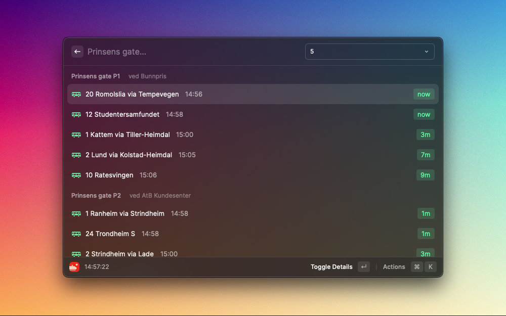
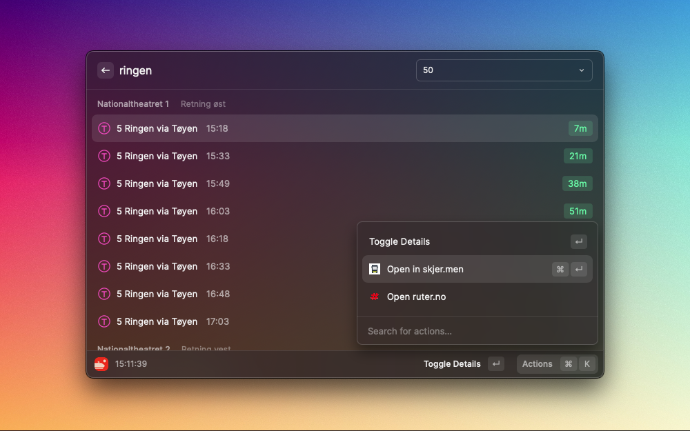

  
  <h1 align="center">Raycast Departures Extension</h1>

Get real-time public transport information from all of Norway straight in your command bar. Search for any stop place or public transport hub near you, and see upcoming departures. If you also save your commonly used stops and lines as favorites for quick access, there will be no faster way to check when you need to get up and go.

Data made available by Entur, using the [Journey Planner API](https://developer.entur.org/pages-journeyplanner-journeyplanner).

## Features

### Search for any stop in Norway

Whether it's a bus stop, train station, ferry terminal, airport, metro or hurtigrute port, you can search for it and see upcoming departures. The stops you save as favorites using ⌘S will show up at once, meaning you don't have to type a thing the next time you bring up the extension.

### View upcoming departures

By default the next 5 departures for each platform at the stop place will be shown, but you can load more using the ⌘+ keyboard shortcut. If your stop has a lot of platforms, you can filter the list by line, mode of transport or authority by typing in the search bar. You can also add your commonly used lines as favorites using ⌘S.

### View details

To see detailed information about a departure, press Enter. This will show a list of upcoming stops, as well as scheduled the scheduled arrival times. All other departure times are real-time, which is a best-guess estimate based on data like the current location of the vehicle.

### Quick access to more detailed information on the web

To see more options about a stop place or departure, you can open the actions panel with ⌘K.

- Departures and stops can be opened in your browser using [Reis Travel Search](https://reise.reisnordland.no/). More information on it's development be found [here](https://github.com/AtB-AS/planner-web).
- Stops can be opened in [skjer.men](https://skjer.men/) to see live location of vehicles. More information on it's development be found [here](https://github.com/toretefre/infoscreen).
- For each departure, there is links to authority web pages for information like ticket purchase.

## Installing

_(If you're part of the `variant-as` organization, just install the [Departures](https://www.raycast.com/variant-as/raycast-departures) extension from the organization page.)_

1. Clone the repo
2. Run `npm install`
3. Run `npm run dev`

## Data source and usage

This extension uses Entur services as the data source. This is an open API, licensed under the Norwegian Licence for Open Government Data (NLOD). More information can be found [here](https://developer.entur.org/pages-intro-setup-and-access#licenses).

There's no authentication needed, but the API has a [rate limit of 1000 requests per minute](https://enturas.atlassian.net/wiki/spaces/PUBLIC/pages/3736993955/Rate-limit+Policy+Journey-Planner-v3#Policy-levels) shared between all users of this extension. This should be plenty for normal use, but if you're making an unusual amount of requests, please consider changing `CLIENT_NAME` in `api.ts`, using [this format](https://developer.entur.org/pages-journeyplanner-journeyplanner#authentication).
